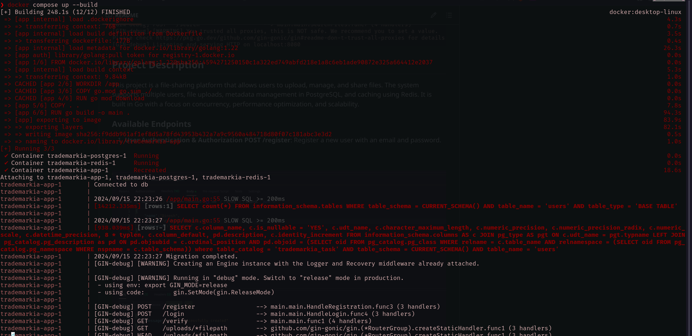
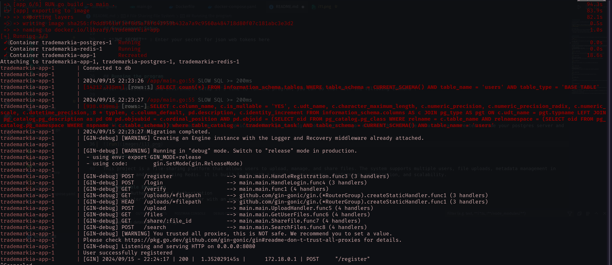
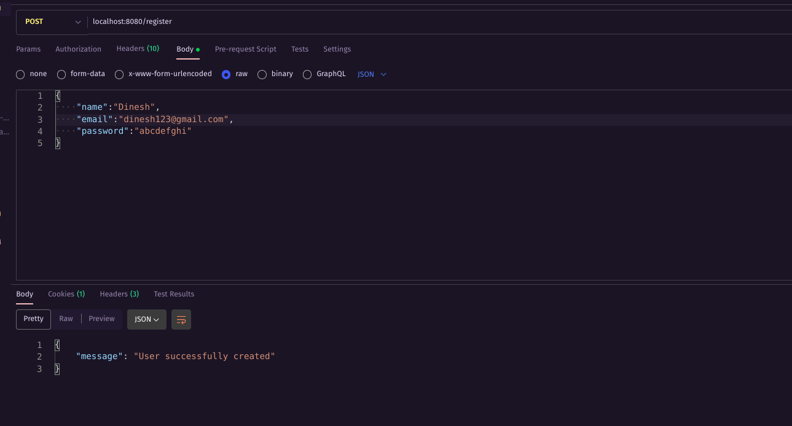
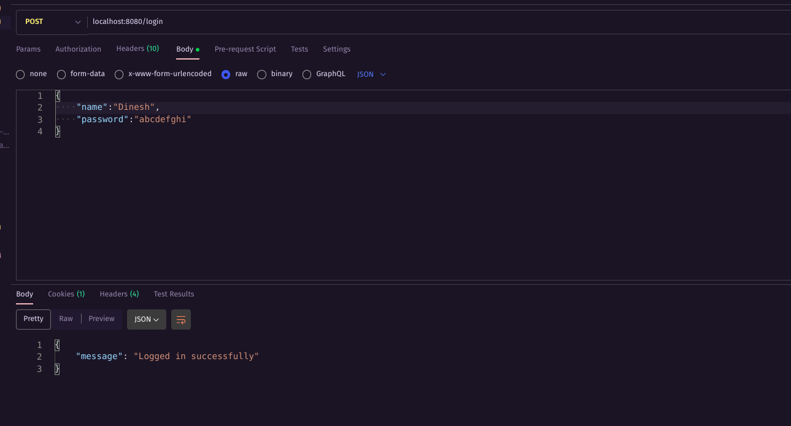
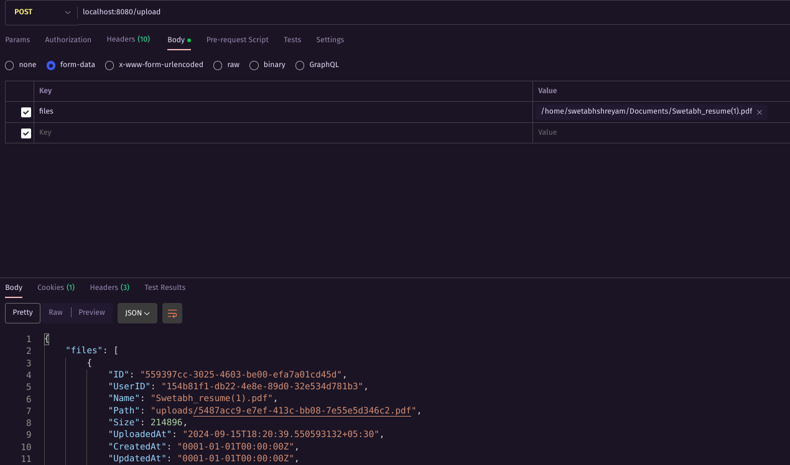
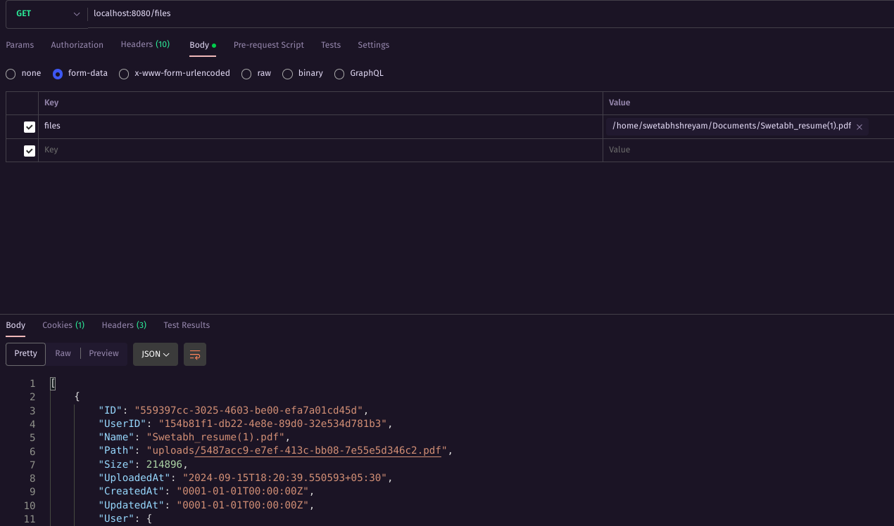
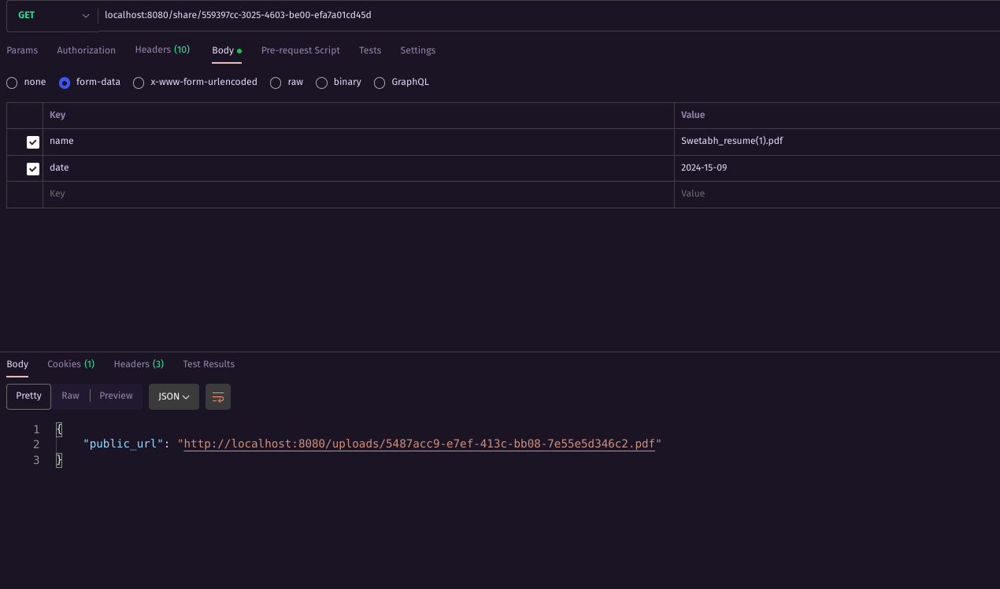
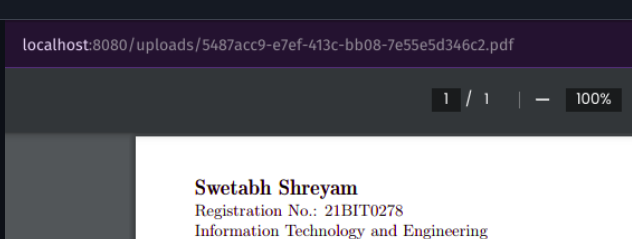
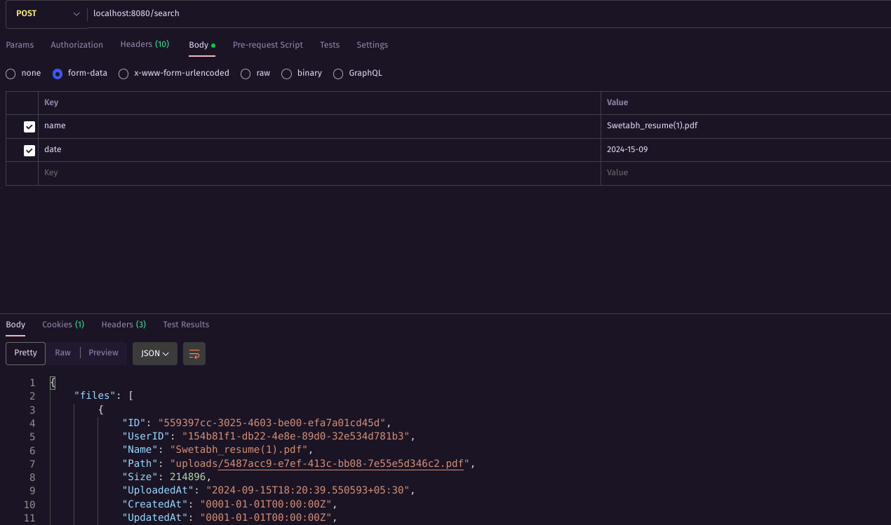

# File Sharing File System

This program implements a File Sharing System using Go

## Installation

The following commands will clone the repository and change the directory into the project.

```bash
git clone https://github.com/Swetabh333/File-Sharing-App.git
cd 21BIT0278_BACKEND
```

## Environment Setup

Edit the docker-compose.yaml file inside the 21BIT0278_BACKEND directory.

You need to set-up the following environment variables :

- **JWT_SECRET** : Enter your secret for json web tokens here

## Running the program

After installation and Environment setup it's time to run the program, you can do that with the following command :

```bash
docker compose up --build
```

It'll take a minute but this should start the application.


</br>
</br>



## Project Description

This project is a file-sharing platform that allows users to upload, manage, and share files. The system supports multiple users, file uploads, metadata management in PostgreSQL, and caching using Redis. It is built in Go with a focus on concurrency, performance optimization, and scalability.

### Available Endpoints

1. **User Authentication & Authorization
   POST /register**: Register a new user with an email and password.
   </br>
   </br>


</br>
</br>
**POST /login**: Login to the system with email and password, generating a JWT token for authorization.
</br>
</br>


</br>
</br> 2. **File Upload & Management
POST /upload**: Upload a file to local storage or S3. The file’s metadata is stored in PostgreSQL.
</br>
</br>


</br>
</br>
**GET /files**: Retrieve metadata for all files uploaded by the authenticated user.

</br>
</br>


</br>
</br> 3. **File Retrieval & Sharing
GET /share/:file_id**
: Share a public link for a specific file, enabling access through the generated URL.

</br>
</br>


</br>
</br>
You can paste the public_url returned from this endpoint and access the file.

</br>
</br>


</br>
</br>

4. **File Search
   GET /search**: Search for files based on metadata like name, upload date, expects form data with name and date.

</br>
</br>


</br>
</br>

5. **Caching Layer for File Metadata**
   </br>
   Implements Redis for caching file metadata to reduce database load. The cache is invalidated when metadata is updated.
   </br>

6. **Middleware for authentication**
   </br>
   Middleware for route protection - /upload, /share, /search routes are protected via the middleware,only an authenticated user can access these.

7. **Background Job for File Deletion**
   </br>
   A background worker periodically deletes expired files from storage and removes the associated metadata from the database.

